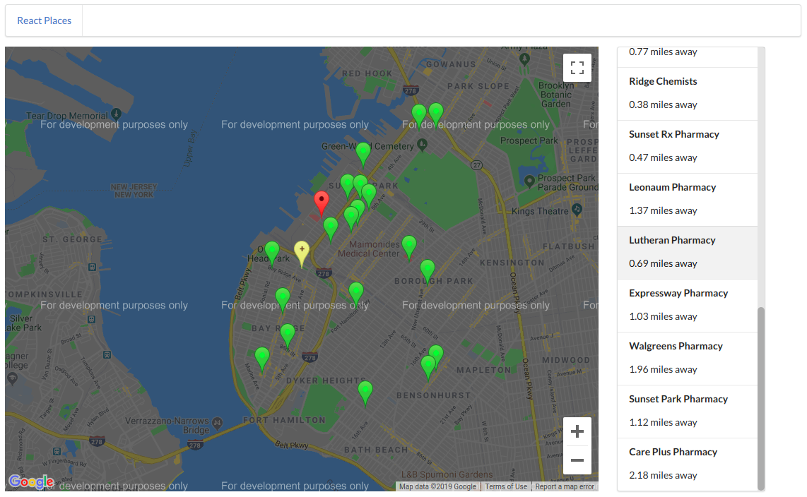
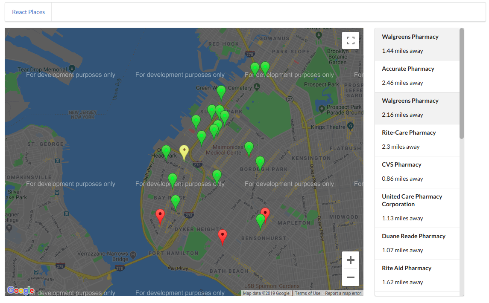
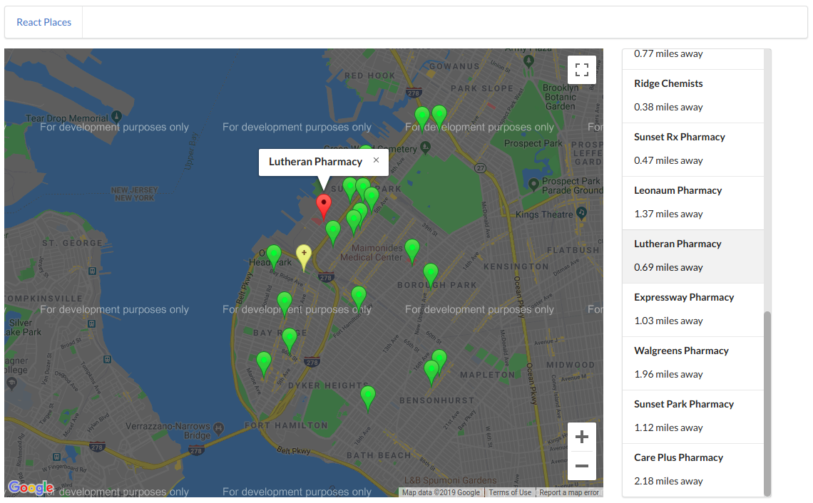

# React Google Maps Search

Search places near you.

(Checkout `code` branch for the source code.)

## About 
- In the home page type in what you want to search for nearby such as "pizza" or "pharmacy".
- You will be redirected to result page where you can scroll through the list and click on place names.
- Your location is marked in yellow, search items in green and items you clicked in the list are shown in red.
- You can also click on the marker to get details.

## Instructions
- To run on local machine:
    - Clone repo `git clone https://github.com/vutsalsinghal/nearby-places.git .`
    - Install packages `npm install`
    - Start dev server `npm start`
    - Note: Create a `.env` file in root dir and add your Google API key as `REACT_APP_API_KEY`

- To run using docker:
    - Clone repo `git clone https://github.com/vutsalsinghal/nearby-places.git .`
    - Install packages `npm install`
    - Update makefile: replace `API_KEY` with your Google maps API key!
    - Run `make run-dev`

### Notes
- You are *strongly* advised to give access to your current location to get good results.
- Uses no backend to make API calls. It's all Rect front-end.
- To circumnavigate CORS issue in localhost, [cors-anywhere](https://github.com/Rob--W/cors-anywhere) is used.
- Due to very less no.of Google Maps API call per day/month, "For developement purposes only" banner might show up on the map.
- Used Circleci for CI/CD to github pages.
- Created a small Docker image (using multi-stage build) to get the app up and running anywhere in no time!